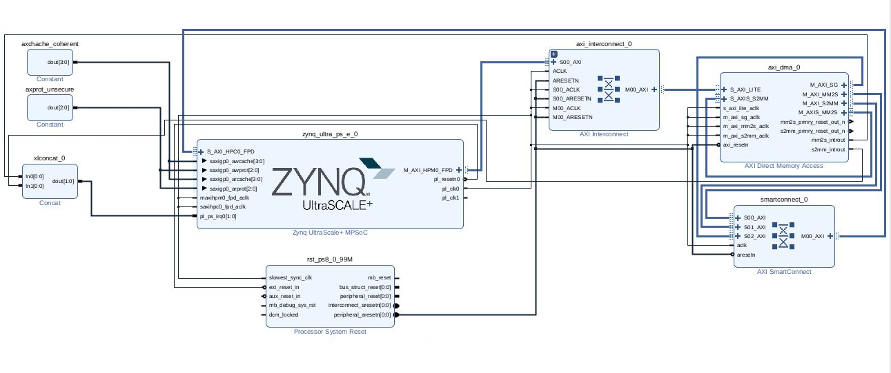

# Kria KR260 DMA Debugging Repository

This repository documents the process of implementing and debugging a userspace-controlled AXI DMA system on the Kria KR260 robotics kit. The goal is a stable DMA data transfer between the Processing System (PS) and Programmable Logic (PL).

This project is part of a submission for the AMD Open Hardware Competition.

## Current Project Status: **Final Debugging Stage**

The project has successfully pivoted to the robust `bperez77/xilinx_axidma` software stack. All software and device tree binding issues have been solved. The `axidma.ko` driver now successfully probes the hardware.

The final remaining issue is a **hardware-level memory corruption bug** that occurs when a DMA transfer is initiated.

---

## Debugging Journey Summary

### Initial Approach (Deprecated)

The initial attempt followed the Xilinx Wiki "DMA Proxy" tutorial. This approach was ultimately unsuccessful due to a fundamental incompatibility between the tutorial's device tree requirements and the Kria's kernel overlay manager, which resulted in a silent driver probe failure. The code for this is in `/Software/linux_dma_tutorial (deprecated)`.

### Current Approach (`xilinx_axidma`) - Near Success

We pivoted to the `bperez77/xilinx_axidma` driver, which proved to be a much more stable and transparent software stack.

#### What Works ✅

1.  **Hardware Generation:** A complete Vivado (2024.1) project has been built and fully debugged. It correctly generates all required artifacts (`.bin`, `.xsa`, `.dtbo`).
2.  **Hardware Loading & Probing:** The custom hardware is successfully loaded onto the Kria using `xmutil`. The kernel's low-level `xilinx-dma` driver successfully probes the AXI DMA, confirming the hardware is fundamentally sound.
3.  **Device Tree Binding:** After significant debugging, a correct device tree overlay was created. This overlay is successfully applied by the kernel.
4.  **Driver Initialization:** The `axidma.ko` kernel module **successfully probes** and initializes. `dmesg` confirms the driver finds the DMA channels:
    ```
    axidma: ... DMA: Found 1 transmit channels and 1 receive channels.
    ```
5.  **Userspace Communication:** The `axidma_benchmark` application successfully opens the `/dev/axidma` device file and initiates a DMA transfer.

#### The Core Problem: Source Memory Corruption ❌

Despite the entire software stack now being functional, the system fails the moment a real data transfer begins.

*   **Symptom:** The `axidma_benchmark` test application fails with the following error:
    ```
    Test failed! The transmit buffer was overwritten at byte 0.
    Expected 0x1234acde, found 0x000000de.
    ```

*   **Root Cause:** This is a **hardware-level memory corruption bug**. The AXI DMA IP, upon being commanded to *read* from the source `tx_buf`, is instead performing a faulty AXI transaction that *destroys* the contents of that same buffer.

*   **Most Likely Cause:** This behavior is a classic symptom of a **misconfiguration in the hardware coherency settings**. The Vivado design currently enables hardware coherency (`dma-coherent`, `AxCACHE`/`AxPROT` signals). An issue in this complex system is the primary suspect for the memory corruption.

## Hardware Block Diagram

This is the core Vivado block design.



